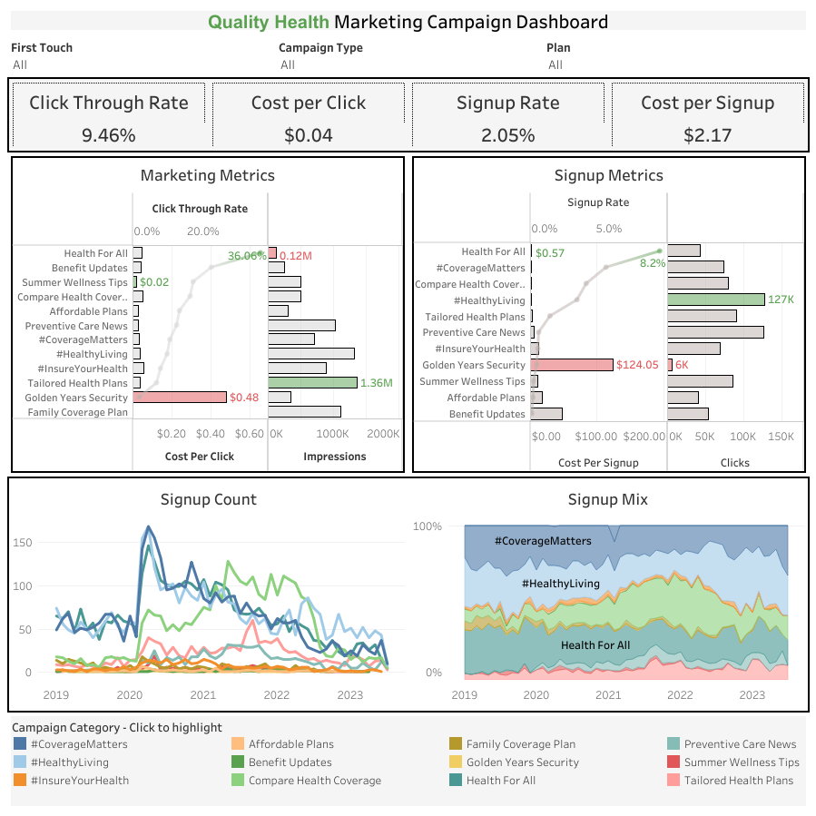
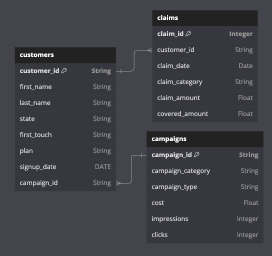

# Quality Health: Marketing Insights

## Objective and Background
Founded in 2016, Quality Health is a medical insurance company serving thousands of customers throughout the United States.  They offer four different health insurance plans: bronze, silver, gold, and platinum, each with different premiums and claim coverage rates.  

<b>In 2019, the company launched 57 ads spanning twelve marketing campaigns</b> ranging from wellness tips, affordabillity of their plans, preventative care, and more. <b>This project analyzes the performance of each campaign and how they relate to signups<strike> and subsequent patient claims</strike>.  It also provides recommendations on how to allocate marketing budgets across future campaigns</b> based on two <strike>three</strike> primary objectives:

<ol>
    <li>
        Raising awareness of Quality Health's brand
    </li>
    <li>
        Increasing the number of customer signups
    </li>
    <li>
        <strike>Identifying which campaigns attract high-value customers</strike>
    </li>
</ol>

## Dashboard
<b>To help the marketing team at Quality Health understand and evaluate the to-date performance of the various marketing campaign categories and to allocate their marketing budget for the year, an interactive <a href="https://public.tableau.com/views/RowHealth_dashboard2/Dashboard44?:language=en-US&publish=yes&:sid=&:display_count=n&:origin=viz_share_link" target="_blank"> Tableau dashboard</a> was developed</b> to deliver insights on the company's key metrics.  The dashboard allows users to filter by a customer's first touch, campaign type, and type of plan, and focuses on KPI reporting for marketing and signup metrics.

    

        Marketing and Signup Dashboard
    

## Dataset Structure
The dataset initially came as an <a href="./data/Row%20Health%20Data.xlsx" target="_blank">Excel workbook</a> containing three sheets:
<ul>
    <li>
        <b>Customers</b>
        <ul>
            <li>
                Table grain: customer_id
            </li>
            <li>
                16,638 unique customers
            </li>
        </ul>
    </li>
    <li>
        <b>Claims</b>
        <ul>
            <li>
                Table grain: claim_id
            </li>
            <li>
                49,998 unique claim ids
            </li>
            <li>
                All claims filed between 2019 - 2023
            </li>
        </ul>
    </li>
    <li>
        <b>Campaigns</b>
        <ul>
            <li>
                Table grain: campaign_id
            </li>
            <li>
                57 unique campaigns
            </li>
            <li>
                12 campaign categories
            </li>
        </ul>
    </li>
</ul>

The dataset was uploaded to a Google BigQuery database with one table for each sheet, as shown in the ERD below.  SQL queries used to supplement the analysis in Tableau can be found <a href="./sql_queries" target="_blank">here</a>.

    

        Entity relationship diagram (ERD) of Quality Health's marketing data
    

## Definitions

<ul>
    <li>
        <b>Campaign Category</b>: Each ad in the campaign belongs to one of twelve broad categories tailored towards attracting customers from different market segments to sign up for a Quality Health Plan:
        <ol>
            <li>
                #CoverageMatters
            </li>
            <li>
                #HealthyLiving
            </li>
            <li>
                #InsureYourHealth
            </li>
            <li>
                Affordable Plans
            </li>
            <li>
                Benefit Updates
            </li>
            <li>
                Compare Health Coverage
            </li>
            <li>
                Family Coverage Plan
            </li>
            <li>
                Golden Years Security
            </li>
            <li>
                Health For All
            </li>
            <li>
                Preventive Care News
            </li>
            <li>
                Summer Wellness Tips
            </li>
            <li>
                Tailored Health Plans
            </li>
        </ol> 
    </li>
</ul>

Each campaign measures data on the following:
<ul>
    <li>
        <b>Impressions</b>: The number of people who saw an ad for a marketing campaign 
    </li>
    <li>
        <b>Clicks</b>: The number of impressions who clicked on an ad after viewing it
    </li>
    <li>
        <b>Signups</b>: The number of clicks who signed up for a health plan after viewing and clicking on an ad
    </li>
</ul>

## North Star Metrics
In evaluating campaign performance, the analysis focus on the following key metrics:
<ul>
    <li>
        <b>Marketing Metrics</b>
        <ul>
            <li>
                <i>Click-Through Rate (CTR)</i>: The percentage of impressions who clicked on the ad
                <ul>
                    <li>
                        CTR = (Total Clicks) / (Total Impressions) * 100
                    </li>
                </ul>
            </li>
            <li>
                <i>Cost Per Click (CPC)</i>: The average dollar amount spent obtaining one click
                <ul>
                    <li>
                        CPC = (Total Cost) / (Total Clicks)
                    </li>
                </ul>
            </li>
            <li>
                <i>Cost Per Impression (CPI)</i>: The average dollar amount spent on obtaining one impression.
                <ul>
                    <li>
                        CPI = (Total Cost) / (Total Impressions)
                    </li>
                </ul>
            </li>
        </ul>
    </li>
    <li>
        <b>Signup Metrics</b>
        <ul>
            <li>
                <i>Signup rate</i>: The percentage of clicks who signed up for a health plan
                <ul>
                    <li>
                        Signup Rate = (Count of Signups) / (Total Clicks) * 100
                    </li>
                </ul>
            </li>
            <li>
                <i>Cost per signup</i>: The average dollar amount spent on obtaining one customer signup
                <ul>
                    <li>
                        Cost per signup = (Total Cost) / (Count of Signups)
                    </li>
                </ul>
            </li>
        </ul>
    </li>
    <strike><li>
       <b>Claims Metrics</b>
        <ul>
            <li>
                <i>Cost per claim</i>: The average cost per claim submitted
            </li>
            <li>
                <i>Claim count</i>: The number of claims submitted
            </li>
        </ul>
    </li></strike>
</ul>

## Summary of Insights
### Marketing Metrics (<a href="./sql_queries/marketing_metrics.sql" target="_blank">SQL Queries</a>)
<table style="margin-left: auto; margin-right: auto">
    <tr>
        <th></th>
        <th>CTR</th>
        <th>CPC</th>
        <th>CPI</th>
        <th>Impressions</th>
    </tr>
    <tr>
        <td>Average</td>
        <td style="text-align: center;">9.46%</td>
        <td style="text-align: center;">$0.04</td>
        <td style="text-align: center;">$0.0087</td>
        <td style="text-align: center;">0.70 million</td>
    </tr>
    <tr>
        <td>Min</td>
        <td style="text-align: center;">1.70%</td>
        <td style="text-align: center;">$0.02</td>
        <td style="text-align: center;">$0.0032</td>
        <td style="text-align: center;">0.12 million</td>
    </tr>
    <tr>
        <td>Max</td>
        <td style="text-align: center;">36.06%</td>
        <td style="text-align: center;">$0.48</td>
        <td style="text-align: center;">$0.0255</td>
        <td style="text-align: center;">1.36 million</td>
    </tr>
</table>

<!-- <ul>
    <li>
        Average CTR: 9.46%
    </li>
    <li>
        Average CPC: $0.04
    </li>
    <li>
        Average Impressions: 0.70 million
    </li>
</ul> -->

<b>Tailored Health Plans had the highest number of impressions (1.36 million) and the third lowest CPI ($0.0037)</b> while <b>Health for All had the lowest impressions (0.12 million) and the highest CPI ($0.0255)</b>.  <b>Despite Tailored Health Plans leading in impressions, the campaign had the second lowest CTR at 6.7%</b>.  

<b>Summer Wellness Tips had the cheapest CPC at $0.02</b>.  However, this isn't vastly different than other campaigns; all but one campaign had a CPC between $0.03 and $0.05.  
<!-- Regardless, the campaign received a healthy 0.51 million impressions and a small difference in price can have a profound impact at a large scale <b>and the campaign received a healthy 0.51 million impressions, making it an attractive choice for future campaigns</b>.   -->
<b>Golden Years Security's CPC was the most expensive CPC by far ($0.48) and an extreme outlier</b>.  Additionally, <b>it received few impressions (0.35 million) and had the lowest CTR (1.7%), making it one of the worst performing campaigns overall</b>.

Despite <b>Health for All</b> having the lowest impressions and one of the more expensive CPCs ($0.05), the campaign <b>had an astonishingly high CTR (36.1%), nearly twice as high as the next best campaign, Benefit Updates (22.2%), and about 4x higher than average</b>.  These results are quite strong considering most campaigns had a CTR between 7-17%.

### Signup Metrics (<a href="./sql_queries/signup_metrics.sql" target="_blank">SQL Queries</a>)
<table style="margin-left: auto; margin-right: auto">
    <tr>
        <th></th>
        <th>Signup Rate</th>
        <th>Cost Per Signup</th>
        <th>Clicks</th>
    </tr>
    <tr>
        <td>Average</td>
        <td style="text-align: center;">2.05%</td>
        <td style="text-align: center;">$2.17</td>
        <td style="text-align: center;">~72,000</td>
    </tr>
    <tr>
        <td>Min</td>
        <td style="text-align: center;">0%</td>
        <td style="text-align: center;">$0.57</td>
        <td style="text-align: center;">5,979</td>
    </tr>
    <tr>
        <td>Max</td>
        <td style="text-align: center;">8.2%</td>
        <td style="text-align: center;">$124.05</td>
        <td style="text-align: center;">~127,000</td>
    </tr>
</table>
<!-- <b>The average signup rate is 2.05%, the average cost per signup is $2.17, and the average number of clicks is ~72,000</b>.   -->

The <b>#HealthyLiving campaign had the highest number of clicks (127k)</b>, while <b>Golden Years Security</b> really struggled and <b>only received about 6k</b>.  <b>Golden Years Security also had the highest cost per signup ($124.05) and one of the lowest signup rates (0.4%)</b>, which continues the pattern of cost inefficiency noticed earlier.  In contrast, <b>Health for All had the highest signup rate (8.2%) and the lowest cost per signup ($0.57)</b>.

Similarly, <b>#Coverage matters, Compare Health Coverage and #HealthyLiving are among the better campaigns in terms of cost efficiency.  They had above average signup rates</b> ranging from 2.9% for #HealthyLiving to 4.8% for #CoverageMatters <b>and a low cost per signup</b> ranging from $0.65 for #CoverageMatters to $1.25 for #HealthyLiving.

On the other end of the spectrum, <b>Summer Wellness Tips, Affordable Plans, Benefit Updates, and Family Coverage Plan had extremely low signup rates</b> ranging from 0% for Family Coverage Plan to 0.2% for Summer Wellness Tips and the cost per signup was high.  

Interestingly, <b>Family Coverage Plan received 1.11 million impressions but had no clicks or signups</b>.  This could indicate a possible data integrity issue and should be investigated.

#### Signups Over Time
<b>When COVID began at the start of 2020, signups resulting from many campaign categories rapidly increased</b>.  The most successful were #CoverageMatters, #HealthyLiving, HealthForAll, and Compare Health Coverage, which experienced roughly 3-5x the number of signups from the previous month.  

<b>Compare Health Coverage was the only campaign to experience continued growth throughout the rest of the year</b>, and signups spiked again in early 2021.  Additionally, <b>the campaign captured the highest number of signups for most months in 2021</b> during a time when other campaigns' signups were stagnating or tapering off.  

<b>In general, signups for campaigns are now at or below pre-pandemic levels</b>. Despite the record spikes early on, <b>#HealthyLiving has returned to roughly the same number of signups in 2023 as before COVID, while #CoverageMatters and HealthForAll are now at all time lows</b>.  

Historically, <b>#HealthyLiving, HealthForAll, and #CoverageMatters are the top three campaigns in terms of signups, typically contributing ~70%</b>.  Despite record lows, the proportion of signups in recent months is about the same as always and these campaigns still constitute about 70% of signups.  <b>In close 4th and 5th place are CompareHealthCoverage and TailoredHealthPlans, which bring in ~15% and ~10% of signups</b>, respectively. 

### Claims
Coming Soon

## Recommendations (<a href="./sql_queries/recommendations.sql" target="_blank">SQL Queries</a>)

Based on the insights listed above, the company should consider the following recommendations:

<ul>
            <li>
                <i>Increase Budget Allocation for Cost-Efficient Campaigns</i>:
                <ul>
                    <li>
                        <b>Health For All had a low CPC and the lowest cost per signup, making it one of the most cost efficient campaigns</b>.  Moreover, it had the highest CTR (36.1%) and the highest signup rate (8.2%); evidence that <b>these ads are highly effective at geting those who see them to click and subsequently sign up</b>.  Unfortunately, the campaign suffered from low impressions (0.12 million), and those who don't see the ad won't sign up.  This could be because Health For All only ran four ads whereas most other campaigns ran five or more, but it's also possible that they were positioned on marketing channels with low viewership.  
                    </li>
                    <li>
                        <b>In the future, the marketing team should consider increasing the budget for this campaign to run more ads and select channels that are likely to reach a larger audience.  If done correctly, this could be the cheapest route to drive signups and create tremendous value</b>.
                    </li>
                </ul>
            </li>
            <li>
                <i>Leverage High Impressions, Clicks, and Signup Rates</i>:
                <ul>
                    <li>
                         <b>Tailored Health Plans' large number of impressions (1.36 million) is a valuable asset, which, if leveraged correctly, has the potential to be a significant driver of future signups</b>.  While the campaign's CTR (6.7%) and signup rate (1.2%) were on the lower side, they're still quite effective at moving large numbers of customers through the marketing funnel when applied on a scale in the millions.
                    </li>
                    <li>
                        Although <b>other campaigns had lower impressions, they had higher signup rates, and are similarly effective at converting customers to a purchase during that cruical last part of the marketing funnel</b>.  For instance, #HealthyLiving had the second highest impressions, the most clicks, and the 4th highest signup rate.  Also of note are Compare Health Coverage and #CoverageMatters which had the 2nd and 3rd highest signup rates, respecively.
                    </li>
                    <li>
                        <b>If these campaigns can be re-tooled to increase their CTR even a little bit, it could reverse the slow decline in signups experienced over the last two years.  The marketing team should consider studying campaigns with high CTR's, such as Health For All, Benefit Updates, Summer Wellness Tips, and adapt any findings to campaigns with high signup rates</b>. 
                    </li>
                </ul>
            </li>
    <li>
        <i>Adjust Strategy for or Divert Funds from Underperforming Campaigns</i>:
        <ul>
            <li>
                <b>Golden Years Security was incredibly cost inefficient</b>.  The campaign had a CPC roughly 12x above average, a cost per signup 60x above average, the lowest CTR, and an extremely low signup rate.  <b>Next steps would be to consult with the business development team to examine whether this market segment is desireable for some reason</b>.  If they're worth targeting, then the marketing team likely needs to adjust their future strategy for this campaign to increase user engagement.  Otherwise, they can divert funds to the other higher performing campaigns mentioned earlier.
            </li>
        </ul> 
    </li>
</ul>
