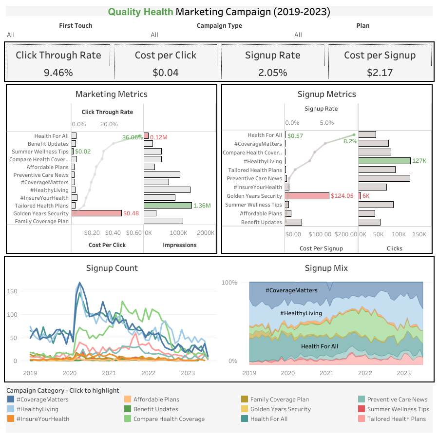
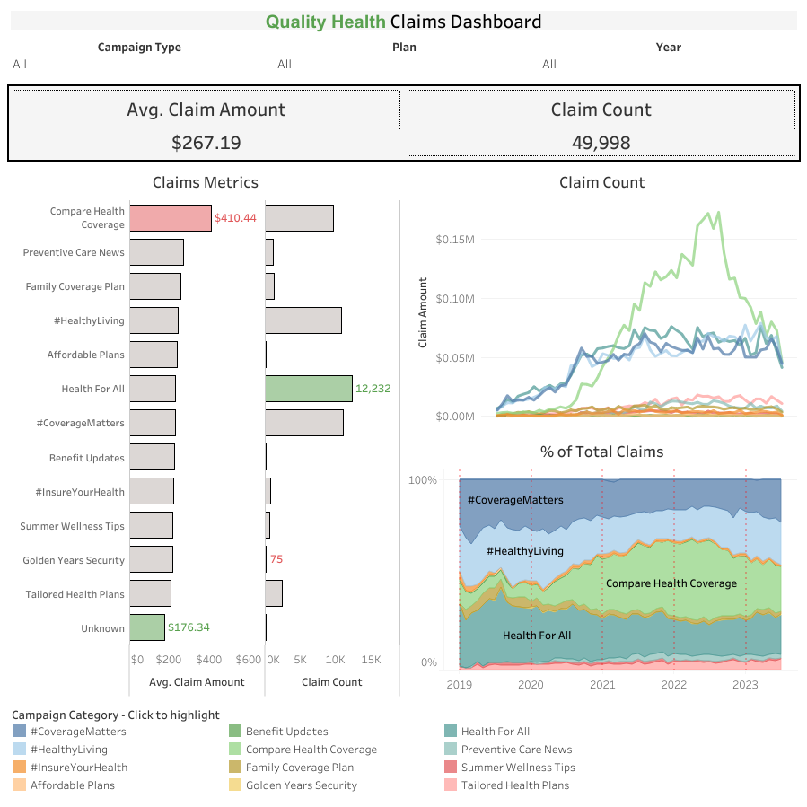

# Quality Health: Marketing Insights

## Objective and Background
Founded in 2016, Quality Health is a medical insurance company serving thousands of customers throughout the United States.  They offer four different health insurance plans: bronze, silver, gold, and platinum, each with different premiums and claim coverage rates.  

<b>In 2019, the company launched 57 ads spanning twelve marketing campaigns</b>, covering a wide range of topics such as wellness tips, affordability of plans, and preventative care. This project is a detailed analysis of the performance of each campaign, its impact on signups, and subsequent patient claims. It also provides strategic recommendations on how to allocate marketing budgets across future campaigns, guided by three primary objectives:

<ol>
    <li>
        Raising awareness of Quality Health's brand
    </li>
    <li>
        Increasing the number of customer signups
    </li>
    <li>
        Identifying which campaigns attract high-value customers
    </li>
</ol>

## Dashboard
<b>Two interactive Tableau dashboards were developed to deliver insights into the company's key metrics.  These dashboards help the marketing team understand and evaluate the performance of the various marketing campaign categories to date and allocate their marketing budget for the year</b>.

<b>The <a href="https://public.tableau.com/views/RowHealth_dashboard2/marketing_campaign_dashboard?:language=en-US&:sid=&:display_count=n&:origin=viz_share_link" target="_blank"> first dashboard</a> focuses on KPI reporting for marketing and signup metrics.  The <a href="https://public.tableau.com/views/RowHealth_claims_dashboard/ClaimsDashboard?:language=en-US&publish=yes&:sid=&:display_count=n&:origin=viz_share_link" target="_blank"> second dashboard</a> focuses on claim metrics</b>.

Marketing and Signup Dashboard

Claims Dashboard

## Definitions

<ul>
    <li>
        <b>Campaign Category</b>: Each ad in the campaign belongs to one of twelve broad categories tailored towards attracting customers from different market segments to sign up for a Quality Health Plan:
        <ol>
            <li>
                #CoverageMatters
            </li>
            <li>
                #HealthyLiving
            </li>
            <li>
                #InsureYourHealth
            </li>
            <li>
                Affordable Plans
            </li>
            <li>
                Benefit Updates
            </li>
            <li>
                Compare Health Coverage
            </li>
            <li>
                Family Coverage Plan
            </li>
            <li>
                Golden Years Security
            </li>
            <li>
                Health For All
            </li>
            <li>
                Preventive Care News
            </li>
            <li>
                Summer Wellness Tips
            </li>
            <li>
                Tailored Health Plans
            </li>
        </ol> 
    </li>
</ul>

Each campaign measures data on the following:
<ul>
    <li>
        <b>Impressions</b>: The number of people who saw an ad for a marketing campaign 
    </li>
    <li>
        <b>Clicks</b>: The number of impressions who clicked on an ad after viewing it
    </li>
    <li>
        <b>Signups</b>: The number of clicks who signed up for a health plan after viewing and clicking on an ad
    </li>
</ul>

## North Star Metrics
In evaluating campaign performance, the analysis focuses on the following key metrics:
<ul>
    <li>
        <b>Marketing Metrics</b>
        <ul>
            <li>
                <i>Click-Through Rate (CTR)</i>: The percentage of impressions who clicked on the ad
                <ul>
                    <li>
                        CTR = (Total Clicks) / (Total Impressions) * 100
                    </li>
                </ul>
            </li>
            <li>
                <i>Cost Per Click (CPC)</i>: The average dollar amount spent obtaining one click
                <ul>
                    <li>
                        CPC = (Total Cost) / (Total Clicks)
                    </li>
                </ul>
            </li>
            <li>
                <i>Cost Per Impression (CPI)</i>: The average dollar amount spent on obtaining one impression
                <ul>
                    <li>
                        CPI = (Total Cost) / (Total Impressions)
                    </li>
                </ul>
            </li>
        </ul>
    </li>
    <li>
        <b>Signup Metrics</b>
        <ul>
            <li>
                <i>Signup Rate</i>: The percentage of clicks who signed up for a health plan
                <ul>
                    <li>
                        Signup Rate = (Count of Signups) / (Total Clicks) * 100
                    </li>
                </ul>
            </li>
            <li>
                <i>Cost Per Signup</i>: The average dollar amount spent on obtaining one customer signup
                <ul>
                    <li>
                        Cost Per Signup = (Total Cost) / (Count of Signups)
                    </li>
                </ul>
            </li>
        </ul>
    </li>
    <li>
       <b>Claims Metrics</b>
        <ul>
            <li>
                <i>Average Claim</i>: The average cost per claim submitted
                <ul>
                    <li>
                        Average Claim = (Total Claim Amounts) / (Count of Claims)
                    </li>
                </ul>
            </li>
            <li>
                <i>Claim Count</i>: The number of claims submitted
            </li>
        </ul>
    </li>
</ul>

## Summary of Insights (<a href="./quality_health_queries.sql" target="_blank">SQL Queries</a>)
### Marketing Metrics 
<table style="margin-left: auto; margin-right: auto">
    <tr>
        <th></th>
        <th>CTR</th>
        <th>CPC</th>
        <th>CPI</th>
        <th>Impressions</th>
    </tr>
    <tr>
        <td style="text-align: center;">Average</td>
        <td style="text-align: center;">9.46%</td>
        <td style="text-align: center;">$0.04</td>
        <td style="text-align: center;">$0.0087</td>
        <td style="text-align: center;">0.70 million</td>
    </tr>
    <tr>
        <td style="text-align: center;">Min</td>
        <td style="text-align: center;">1.70%</td>
        <td style="text-align: center;">$0.02</td>
        <td style="text-align: center;">$0.0032</td>
        <td style="text-align: center;">0.12 million</td>
    </tr>
    <tr>
        <td style="text-align: center;">Max</td>
        <td style="text-align: center;">36.06%</td>
        <td style="text-align: center;">$0.48</td>
        <td style="text-align: center;">$0.0255</td>
        <td style="text-align: center;">1.36 million</td>
    </tr>
</table>

<!-- <ul>
    <li>
        Average CTR: 9.46%
    </li>
    <li>
        Average CPC: $0.04
    </li>
    <li>
        Average Impressions: 0.70 million
    </li>
</ul> -->

<b>Tailored Health Plans had the highest number of impressions (1.36 million) and the third lowest CPI ($0.0037)</b>, while <b>Health for All had the lowest impressions (0.12 million) and the highest CPI ($0.0255)</b>.  <b>Despite Tailored Health Plans leading in impressions, the campaign had the second-lowest CTR at 6.7%</b>.  

<b>Summer Wellness Tips had the cheapest CPC at $0.02</b>.  However, this is similar to other campaigns; all but one campaign had a CPC between $0.03 and $0.05.  
<!-- Regardless, the campaign received a healthy 0.51 million impressions and a small difference in price can have a profound impact at a large scale <b>and the campaign received a healthy 0.51 million impressions, making it an attractive choice for future campaigns</b>.   -->
<b>Golden Years Security's CPC was the most expensive CPC ($0.48) and an extreme outlier</b>.  Additionally, <b>it received few impressions (0.35 million) and had the lowest CTR (1.7%), making it one of the worst-performing campaigns overall</b>.

Despite <b>Health for All</b> having the lowest impressions and one of the more expensive CPCs ($0.05), the campaign <b>had an astonishingly high CTR (36.1%), nearly twice as high as the next best campaign, Benefit Updates (22.2%), and about 4x higher than average</b>.  These results are robust, considering that most campaigns had a 7-17% CTR.

### Signup Metrics
<table style="margin-left: auto; margin-right: auto">
    <tr>
        <th></th>
        <th>Signup Rate</th>
        <th>Cost Per Signup</th>
        <th>Clicks</th>
    </tr>
    <tr>
        <td style="text-align: center;">Average</td>
        <td style="text-align: center;">2.05%</td>
        <td style="text-align: center;">$2.17</td>
        <td style="text-align: center;">~72,000</td>
    </tr>
    <tr>
        <td style="text-align: center;">Min</td>
        <td style="text-align: center;">0%</td>
        <td style="text-align: center;">$0.57</td>
        <td style="text-align: center;">5,979</td>
    </tr>
    <tr>
        <td style="text-align: center;">Max</td>
        <td style="text-align: center;">8.2%</td>
        <td style="text-align: center;">$124.05</td>
        <td style="text-align: center;">~127,000</td>
    </tr>
</table>
<!-- <b>The average signup rate is 2.05%, the average cost per signup is $2.17, and the average number of clicks is ~72,000</b>.   -->

The <b>#HealthyLiving campaign had the highest number of clicks (127k)</b>, while <b>Golden Years Security</b> struggled and <b>only received about 6k</b>.  <b>Golden Years Security also had the highest cost per signup ($124.05) and one of the lowest signup rates (0.4%)</b>, which continues the pattern of cost inefficiency noticed earlier.  In contrast, <b>Health for All had the highest signup rate (8.2%) and the lowest cost per signup ($0.57)</b>.

Similarly, <b>#CoverageMatters, Compare Health Coverage, and #HealthyLiving are among the better campaigns in terms of cost efficiency.  They had above-average signup rates</b> ranging from 2.9% for #HealthyLiving to 4.8% for #CoverageMatters <b>and a low cost per signup</b> ranging from $0.65 for #CoverageMatters to $1.25 for #HealthyLiving.

On the other end of the spectrum, <b>Summer Wellness Tips, Affordable Plans, Benefit Updates, and Family Coverage Plan had meager signup rates</b> ranging from 0% for Family Coverage Plan to 0.2% for Summer Wellness Tips and the cost per signup was high.  

Interestingly, <b>Family Coverage Plan received 1.11 million impressions but had no clicks or signups</b>.  This could indicate a possible data integrity issue and should be investigated.

### Signups Over Time
<table style="margin-left: auto; margin-right: auto">
    <tr>
        <th></th>
        <th style="text-align: center;">2019</th>
        <th style="text-align: center;">2020</th>
        <th style="text-align: center;">2021</th>
        <th style="text-align: center;">2022</th>
        <th style="text-align: center;">2023</th>
    </tr>
    <tr>
        <td style="text-align: center;">Signup Count</td>
        <td style="text-align: center;">2,465</td>
        <td style="text-align: center;">5,154</td>
        <td style="text-align: center;">4,931</td>
        <td style="text-align: center;">2,923</td>
        <td style="text-align: center;">865</td>
    </tr>
</table>
<b>When COVID began at the start of 2020, signups resulting from many campaign categories rapidly increased</b>.  The most successful were #CoverageMatters, #HealthyLiving, HealthForAll, and Compare Health Coverage, which experienced roughly 3-5x the number of signups from the previous month.  

<b>Compare Health Coverage was the only campaign to experience continued growth throughout the rest of the year</b>, and signups spiked again in early 2021.  Additionally, <b>the campaign captured the highest number of signups for most months in 2021</b> during a time while other campaigns' signups stagnated or tapered off.  

<b>In general, signups for campaigns are now at or below pre-pandemic levels</b>. Despite the record spikes early on, <b>#HealthyLiving has returned to roughly the same number of signups in 2023 as before COVID, while #CoverageMatters and HealthForAll are now at all-time lows</b>.  

Historically, <b>#HealthyLiving, HealthForAll, and #CoverageMatters are the top three campaigns in terms of signups, typically contributing ~70%</b>.  Despite record lows, the proportion of signups in recent months is about the same as always, and these campaigns still constitute about 70% of signups.  <b>In close 4th and 5th place are CompareHealthCoverage and TailoredHealthPlans, which bring in ~15% and ~10% of signups</b>, respectively. 

### Claims Metrics
<b>Across all campaigns, the average claim amount is $267.19</b>, and <b>most individual campaigns' claims averaged ~$170-$270</b>. The <b>four campaigns</b> listed below <b>comprise ~87% of all claims</b> made between 2019 and 2023:
<table style="margin-left: auto; margin-right: auto">
    <tr>
        <th style="text-align: center;">Campaign</th>
        <th style="text-align: center;">Claim Count</th>
        <th style="text-align: center;">% of Total</th>
        <th style="text-align: center;">Avg. Claim Amount</th>
    </tr>
    <tr>
        <td style="text-align: center;">Health For All</td>
        <td style="text-align: center;">12,232</td>
        <td style="text-align: center;">24%</td>
        <td style="text-align: center;">$231</td>
    </tr>
        <tr>
        <td style="text-align: center;">#CoverageMatters</td>
        <td style="text-align: center;">11,016</td>
        <td style="text-align: center;">22%</td>
        <td style="text-align: center;">$228</td>
    </tr>
    </tr>
        <tr>
        <td style="text-align: center;">#HealthyLiving</td>
        <td style="text-align: center;">10,707</td>
        <td style="text-align: center;">21%</td>
        <td style="text-align: center;">$244</td>
    </tr>
    </tr>
        <tr>
        <td style="text-align: center;">#Compare Health Coverage</td>
        <td style="text-align: center;">9,507</td>
        <td style="text-align: center;">19%</td>
        <td style="text-align: center;">$410</td>
    </tr>
    <!-- </tr>
        <tr>
        <td style="text-align: center;">Tailored Health Plans</td>
        <td style="text-align: center;">2,347</td>
        <td style="text-align: center;">5%</td>
        <td style="text-align: center;">$209</td>
    </tr> -->
</table>

Claims counts for these four campaigns rose at the pandemic's start in early 2020 and plateaued in mid-2020.  From there, counts remained consistent, except for <b>Compare Health Coverage</b>.  This campaign <b>continued to have more claims filed until peaking in May 2022 at $0.14 million, which was roughly twice as costly as the next campaign</b>.  Claim counts dropped sharply in the following months, and now all four campaigns see approximately the same number of claims as each other.  

Interestingly, <b>Compare Health Coverage has the least claims filed, but the average claim amount was quite high ($410.44), indicating that these customers tend to file much more expensive claims</b>.

<b>Note: there are 132 claims totaling $0.02 million where no campaign category is listed</b>, which could indicate another data quality issue where some campaigns aren't accurately capturing customer signups. 

## Recommendations

Based on the insights listed above, the company should consider the following recommendations:

<ul>
            <li>
                <i>Increase Budget Allocation for High Performing Campaigns or Campaigns that Attract High Value Customers</i>:
                <ul>
                    <li>
                        <b>Health For All was one of the best-performing campaigns, and its ads are highly effective at generating clicks and signups</b>.  The campaign had the lowest cost per signup ($0.57), the highest CTR (36.1%), and the highest signup rate (8.2%).  Unfortunately, those who don't see its ads won't sign up, and the campaign suffered from low impressions (0.12 million).
                    </li>
                    <li>
                        <b>The marketing team should consider increasing the budget for this campaign.  Run more ads and carefully select channels likely to reach larger audiences</b>.
                    </li>
                </ul>
            </li>
            <li>
                <i>Increase Budget Allocation for Campaigns that Attract High Value Customers</i>:
                <ul>
                    <li>
                        <b>#HealthyLiving and #CoverageMatters comprise 43% of claims made, and average claim amounts are less expensive</b>.  Consequently, <b>customers who sign up from these campaigns are less costly and highly desirable</b>. 
                    </li>
                    <li>
                        <b>The marketing team should consider increasing these campaigns' budgets to attract more of these customers</b>.
                    </li>
                </ul>
            </li>
            <li>
                <i>Leverage High Impressions, Clicks, and Signup Rates</i>:
                <ul>
                    <li>
                         <b>Tailored Health Plans' large number of impressions (1.36 million) is valuable</b>.  Although the campaign had a lower CTR (6.7%) and signup rate (1.2%), it was still effective at moving large numbers of customers through the marketing funnel because so many people viewed these ads.
                    </li>
                    <li>
                        <b>#HealthyLiving and #CoverageMatters have high signup rates and effectively convert customers to a purchase</b>.  #HealthyLiving had the second-highest impressions, the most clicks, and the fourth-highest signup rate.  #CoverageMatters had the third-highest signup rate.
                            <ul>
                                <li>
                                    <b>While #CompareHealthCoverage had the second-highest signup rate, it also had the highest average claim amounts, and its customers are costly.  Preference should be given to #HealthyLiving and #CoverageMatters</b>, which had much more reasonable average claim amounts.  
                                </li>
                            </ul>
                    </li>
                    <li>
                        <b>The marketing team should study campaigns with high CTRs and adapt any findings to campaigns with high signup rates. Small increases in their CTR could lead to many new signups</b>. 
                    </li>
                </ul>
            </li>
    <li>
        <i>Adjust Strategy for or Divert Funds from Underperforming Campaigns</i>:
        <ul>
            <li>
                <b>Golden Years Security was incredibly cost-inefficient</b>.  The campaign had a CPC of roughly 12x above average, a cost per signup of 60x above average, the lowest CTR, and a low signup rate. 
            </Li> 
            <li>
                <b>The marketing team should consult with business development to examine whether this market segment is desirable</b>. If it's worth targeting, future campaign strategy needs to adjust to increase user engagement. Otherwise, funds for these ads can be diverted to higher-performing campaigns.
            </li>
        </ul> 
    </li>
</ul>

## Dataset Structure
The dataset initially came as an <a href="./data/Row%20Health%20Data.xlsx" target="_blank">Excel workbook</a> containing three sheets:
<ul>
    <li>
        <b>Customers</b>
        <ul>
            <li>
                Table grain: customer_id
            </li>
            <li>
                16,638 unique customers
            </li>
        </ul>
    </li>
    <li>
        <b>Claims</b>
        <ul>
            <li>
                Table grain: claim_id
            </li>
            <li>
                49,998 unique claim ids
            </li>
            <li>
                All claims filed between 2019 - 2023
            </li>
        </ul>
    </li>
    <li>
        <b>Campaigns</b>
        <ul>
            <li>
                Table grain: campaign_id
            </li>
            <li>
                57 unique campaigns
            </li>
            <li>
                12 campaign categories
            </li>
        </ul>
    </li>
</ul>

The dataset was uploaded to a Google BigQuery database with one table for each sheet, as shown in the ERD below.  SQL queries used to supplement the analysis in Tableau can be found <a href="./quality_health_queries.sql" target="_blank">here</a>.

Entity relationship diagram (ERD) of Quality Health's marketing data
